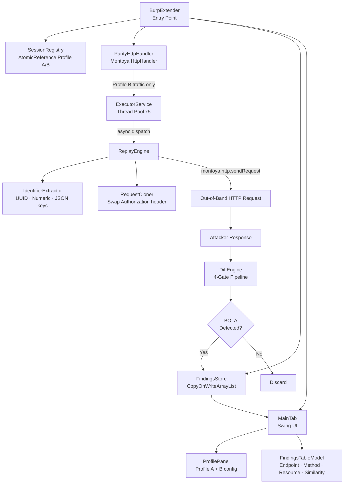
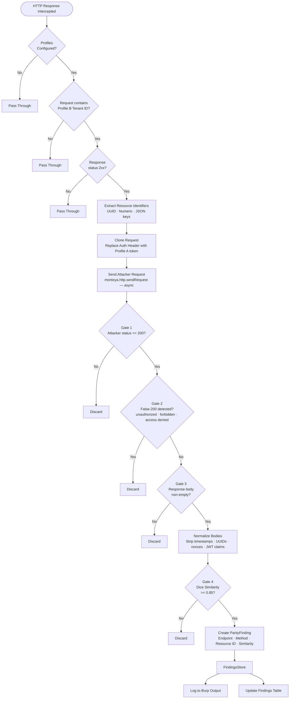

# Parity

A Burp Suite extension for automated Cross-Tenant BOLA (Broken Object Level Authorization) and IDOR detection across SaaS API workflows.

Built using the [Montoya API](https://portswigger.github.io/burp-extensions-montoya-api/javadoc/burp/api/montoya/MontoyaApi.html).

---

## What it does

Modern SaaS applications serve multiple tenants from a shared infrastructure. A Cross-Tenant BOLA vulnerability occurs when Tenant A can access or manipulate resources belonging to Tenant B by substituting resource identifiers in API requests.

Manual testing for this class of vulnerability is slow and error-prone. Parity automates the detection cycle by:

1. Intercepting authenticated requests from a configured victim session (Profile B)
2. Extracting resource identifiers from the URL, query parameters, and request body
3. Cloning each request with attacker credentials (Profile A) while preserving all resource identifiers
4. Sending the cloned request out-of-band via the Montoya HTTP engine
5. Diffing the two responses using a Sørensen–Dice similarity algorithm with false-200 detection
6. Logging confirmed findings to a structured UI table

---

## System Architecture



---

## Logic Flow — Detection Pipeline



---

## Package Structure

```
com.parity.hunter/
├── extension/        # BurpExtender — entry point, wires all components
├── config/           # Profile, SessionRegistry — thread-safe credential store
├── http/             # ParityHttpHandler, RequestCloner — interception + cloning
├── analysis/         # IdentifierExtractor, DiffEngine, SimilarityCalculator
├── engine/           # ReplayEngine — out-of-band attack execution
├── model/            # ParityFinding, FindingsStore — immutable finding records
└── ui/               # MainTab, ProfilePanel, FindingsTableModel — Swing UI
```

---

## Detection Logic — DiffEngine Gates

The DiffEngine uses a four-gate pipeline to minimise false positives:

| Gate | Check | Purpose |
|------|-------|---------|
| 1 | Attacker response status == 200 | Eliminates outright rejections |
| 2 | False-200 detection | Catches APIs returning 200 with embedded error messages |
| 3 | Non-empty body | Skips inconclusive empty responses |
| 4 | Dice similarity >= 0.85 | Structural comparison after noise normalisation |

Noise normalisation strips Unix timestamps, UUIDs, nonces, and JWT temporal claims (`iat`, `exp`) before comparison to reduce false negatives from rotating dynamic fields.

---

## Requirements

- Burp Suite Professional (Montoya API requires Pro)
- Java 17+
- Maven 3.8+

---

## Installation

### Option A — Build from source

```bash
git clone https://github.com/inok009/parity.git
cd parity
mvn clean package
```

The compiled JAR will be at:
```
target/parity-1.0.0.jar
```

Load in Burp:
> Extensions → Add → Extension type: Java → Select JAR

### Option B — Download release JAR

Download the latest JAR from the [Releases](../../releases) page and load directly into Burp.

---

## Usage

1. Open the **Parity** tab in Burp Suite
2. Navigate to the **Profiles** sub-tab
3. Configure **Profile A (Attacker)** — paste the Authorization header value and a unique tenant identifier
4. Configure **Profile B (Victim)** — paste the victim's Authorization header value and tenant identifier
5. Click **Save Profile** for both — the status label confirms successful registration
6. Browse the target application using the victim's session through Burp Proxy
7. Switch to the **Findings** sub-tab to view detected vulnerabilities
8. Click **Refresh Findings** to update the table

---

## Known Limitations

- Cookie-based authentication requires manual mapping of the cookie value into the Authorization header field
- GraphQL APIs with batched queries are not fully supported in this version
- Chunked transfer encoding responses may produce lower similarity scores
- Rate-limited targets may trigger token expiry between baseline and replay requests

---

## Disclaimer

This tool is intended for use only against applications you own or have explicit written authorisation to test. Unauthorised use against third-party systems is illegal. The author assumes no liability for misuse.

---

## Author

**Ananyay Banerjee**
[GitHub](https://github.com/inok009)
---

## License

MIT — see [LICENSE](LICENSE)